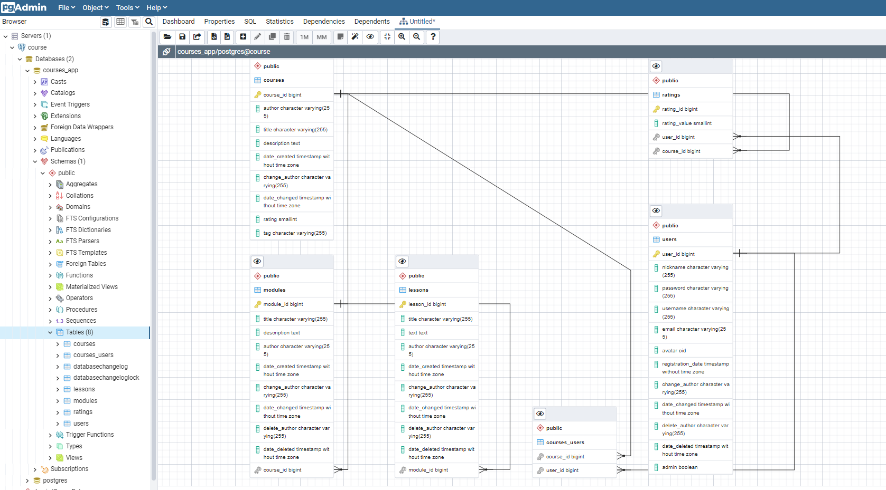

Финальное задание обучения на Java Middle Developer MTS-Teta (Stepik.org)

Проект представляет из себя MVP образовательной платформы (аналог Coursera, Stepik)
Стек: Spring Boot, Thymeleaf, PostgreSQL

PostgreSQL Schema: 
Сущности: Course --(OneToMany)-> Module --(OneToMany)-> Lesson, User --(ManyToMany)-> Role

Реализован WebUI(Thymeleaf), а так же RestAPI

Описание ролей:
ROLE_STUDENT - может просматривать и изменять данные своей учетной записи, может пользоваться поиском по доступным ему
курсам, может просматривать содержимое уроков и отмечать их как пройденные (пройденные уроки отображаются в разделе
Account)

ROLE_ADMIN, ROLE_TEACHER - Может создавать, изменять, удалять курсы, модули, уроки, пользователей, роли пользователей.
Может изменять данные своей учетной записи, пользоваться поиском по всем курсам, имеет доступ ко всем курсам. Может
предоставлять доступ пользователям к урокам.

В проекте присутствуют Контейнеризованные интеграционные тесты сервисов (на хосте требуется установленный Docker), Также
есть тесты REST API контроллеров.